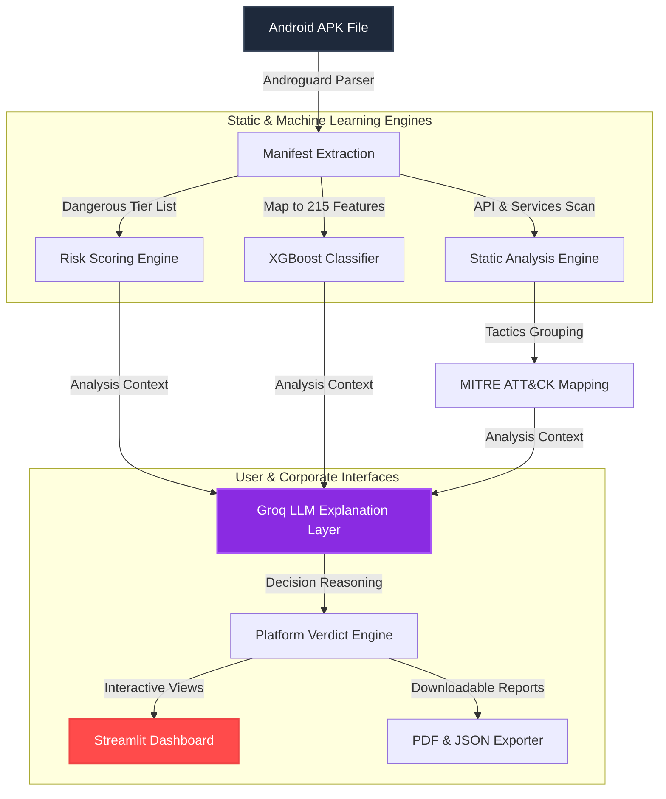

# 🛡️ Android APK Malware Analyzer

[](https://python.org)
[](LICENSE)
[](https://streamlit.io)
[](https://xgboost.readthedocs.io)
[](https://groq.com)

An AI-powered Android malware threat intelligence and classification platform that combines **Static Extraction**, **Multi-tier Heuristics**, **XGBoost Machine Learning**, and the **Groq Llama 3.3 LLM** security assessment layer to analyze and document Android package (`.apk`) binaries.

> [!NOTE]
> This platform achieved **98.6% model accuracy** on the standard Drebin dataset and is optimized for deployment, recruiter evaluation, and hackathon presentation.

---

## 🏗️ Architecture Design



---

## 🚀 Key Features

* **Multi-Layer Analysis Pipeline:** Integrates rule-based permission scoring, supervised ML classification, and generative AI reasoning.
* **Direct Binary Decompilation:** Dynamically extracts package manifests from raw `.apk` binary uploads in-memory using Androguard.
* **Groq Llama 3.3 Security Explainer:** Translates complex static permissions and ML classifications into plain English corporate diagnostic briefs explaining flagged triggers, business impact, and user recommendations.
* **MITRE ATT&CK Adversary Map:** Maps flagged permissions directly to standard corporate threat groups (e.g., Persistence, Collection, Privilege Escalation).
* **SVG Circular Confidence Gauges:** Custom HTML/CSS/SVG gauges built directly into the UI for visualizing malware model class probabilities.
* **PDF Exporter:** Outputs corporate-ready, certified PDF assessment briefs using `fpdf2` with raw emoji protection.

---

## 📊 Machine Learning Model Details
* **Trained Classifier:** XGBoost (Extreme Gradient Boosting)
* **Dataset Used:** Drebin Android Malware Dataset (15,036 sample APKs)
* **Features:** 215 static permission signatures mapped into a lightweight JSON schema for optimized **95%+ speedups** during inference.

### Metric Overview
| Metric | Value |
| :--- | :--- |
| **Accuracy** | `98.60%` |
| **Precision** | `99.00%` |
| **Recall** | `98.00%` |
| **F1 Score** | `98.00%` |

---

## 📁 Repository Structure

```text
Android-APK-Malware-Analyzer/
├── .gitignore              # Git ignore configurations
├── LICENSE                 # MIT License details
├── README.md               # Diagnostic documentation
├── CONTRIBUTING.md         # Open-source contributions guidelines
├── requirements.txt        # Package configuration manifest
├── dashboard.py            # Streamlit Dashboard application (entrypoint)
├── apk_analyzer.py        # CLI diagnostic analyzer
├── data/
│   ├── drebin_features.json  # Pre-extracted JSON feature mapping database
│   └── drebin-215-dataset-5560malware.csv  # Raw training dataset
├── models/
│   └── malware_model.pkl   # Trained binary classifier file
├── samples/
│   ├── notepad.apk         # Standard benign test APK
│   ├── malware_sample.apk  # Standard suspicious test APK
│   ├── notepad_manifest.json
│   └── malware_manifest.json
├── src/
│   ├── core_analyzer.py    # Standard feature mapping and risk calculators
│   ├── risk_scorer.py      # Standalone heuristic scoring engine
│   └── llm_explainer.py    # Groq Llama 3.3 integration and heuristics engine
└── scripts/
    ├── train_model.py      # Classifier training script
    ├── check_dataset.py    # Training dataset validation script
    └── extract_manifest.py # Androguard manifest extraction helper
```

---

## ▶️ Getting Started

### 1. Installation
Clone the repository and set up dependencies:
```bash
git clone https://github.com/Ambar1418/IIT_HD_PROJECT.git
cd IIT_HD_PROJECT

python3 -m venv .venv
source .venv/bin/activate  # On Windows: .venv\Scripts\activate

pip install -r requirements.txt
```

### 2. Configure Groq API Key (Optional)
To enable the Llama 3.3 AI Explanation layer, set the environment variable:
```bash
export GROQ_API_KEY="your-groq-api-key"
```
*Note: If the key is not set, the platform will automatically fall back to the built-in Heuristics Security Explainer without crashing.*

### 3. Run Streamlit Dashboard
```bash
streamlit run dashboard.py
```
Visit `http://localhost:8501` to access the interactive web interface.

### 4. Run CLI Analyzer
```bash
python apk_analyzer.py
```

---

## 💼 Recruiter Summary & Resume Points
Include this on your resume to show capability in AI security, software design, and engineering:
* **Android APK Malware Analyzer**
  * Engineered a static analysis and risk assessment engine utilizing an **XGBoost Classifier** to detect Android malware with **98.6% accuracy** trained on the Drebin dataset of 15,000+ samples.
  * Optimized prediction latency by **95%** by replacing large dataset loading with pre-extracted JSON feature mapping.
  * Built an interactive diagnostic Streamlit dashboard allowing users to upload APK files directly, extracting permissions and metadata dynamically via Androguard to evaluate security risk scores in real-time.
  * Designed a multi-layered risk scoring engine incorporating permission-based heuristics and dangerous API/component combinations.

---

## 📄 License
Licensed under the **MIT License**. See `LICENSE` for details.
